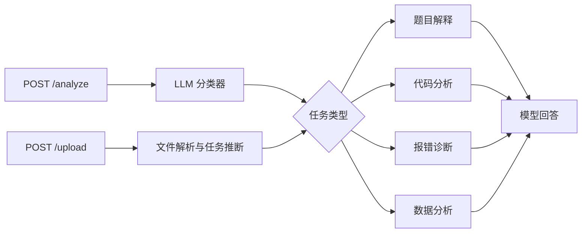

# DataMentor AI

DataMentor AI 是一个面向学习场景的 LangGraph + FastAPI 演示项目。它会把用户请求分类为题目解释、代码分析、报错诊断或数据分析，并将任务路由到对应的提示词节点。

> 本仓库用于展示 LangGraph 条件路由和文件解析，不是生产级在线服务。上传内容会被发送给你配置的第三方模型服务，请勿上传密钥、个人信息或其他敏感数据。

## 功能

- 文本请求自动分类与分析
- 代码、报错、题目和数据四类处理节点
- 上传代码、文本、CSV、Excel 和 Jupyter Notebook
- OpenAI SDK 兼容的模型接口
- FastAPI 自动生成的交互式 API 文档
- 无需真实 API 密钥的离线自动测试

## 工作流



当前工作流是一个轻量的条件路由示例，不包含多轮记忆、RAG、工具调用或持久化 checkpoint。

## 支持的文件

| 类型 | 后缀 | 路由 |
| --- | --- | --- |
| 代码 | `.py`、`.r`、`.ipynb` | 代码分析 |
| 数据 | `.csv`、`.xlsx` | 数据分析 |
| 文本 | `.txt`、`.md`、`.sql`、`.json` | 题目解释 |

上传大小限制为 5 MB。解析后的内容最多保留 30,000 个字符，以控制模型上下文和调用成本。

## 快速开始

要求 Python 3.11 或更高版本。

```bash
git clone <your-repository-url>
cd LongGraph_test
python -m venv .venv
```

Windows PowerShell：

```powershell
.\.venv\Scripts\Activate.ps1
python -m pip install -r requirements.txt
Copy-Item .env.example .env
```

macOS/Linux：

```bash
source .venv/bin/activate
python -m pip install -r requirements.txt
cp .env.example .env
```

编辑 `.env`，填写模型服务商提供的配置：

```dotenv
API_KEY=your-real-api-key
BASE_URL=https://your-provider.example/v1
MODEL_NAME=your-model-name
```

`BASE_URL` 可留空，此时 OpenAI SDK 使用其默认地址。`.env` 已被 Git 忽略，切勿把真实密钥写入 `.env.example`。

启动服务：

```bash
uvicorn app.main:app --reload
```

打开 <http://127.0.0.1:8000/docs> 使用 Swagger UI。

## API 示例

文本分析：

```bash
curl -X POST http://127.0.0.1:8000/analyze \
  -H "Content-Type: application/json" \
  -d '{"user_input":"请解释 Python 装饰器的作用"}'
```

文件分析：

```bash
curl -X POST http://127.0.0.1:8000/upload \
  -F "file=@sample.csv"
```

## 测试

测试会 mock 模型调用，不会访问外部服务或消耗 API 额度。

```bash
python -m pip install -r requirements-dev.txt
python -m pytest
```

GitHub Actions 会在每次 push 和 pull request 时自动执行相同测试。

## 项目结构

```text
app/
├── graph.py              # LangGraph 工作流
├── llm.py                # 模型客户端封装
├── main.py               # FastAPI 入口
├── state.py              # 图状态定义
├── nodes/                # 分类与任务节点
└── utils/file_parser.py  # 上传文件解析
tests/                    # 离线自动测试
.github/workflows/ci.yml  # GitHub Actions
```

## 已知限制

- 分类与回答质量取决于所配置的模型。
- CSV/Excel 仅向模型提供字段、数据规模和前几行摘要。
- 项目没有用户鉴权、持久化、限流或计费保护，不应直接暴露为公共生产 API。
- 提示词防护只能降低风险，不能完全消除上传内容中的 prompt injection。

## License

本项目采用 [MIT License](LICENSE)。
